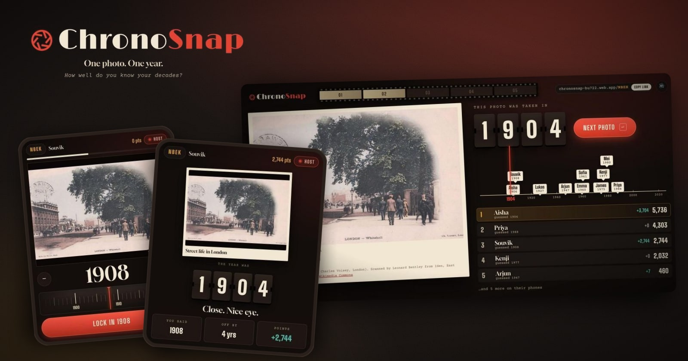
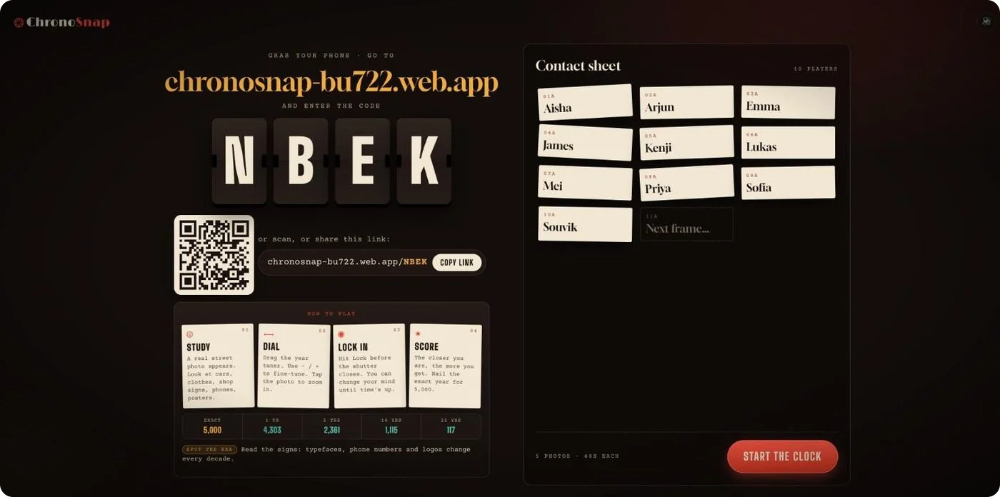
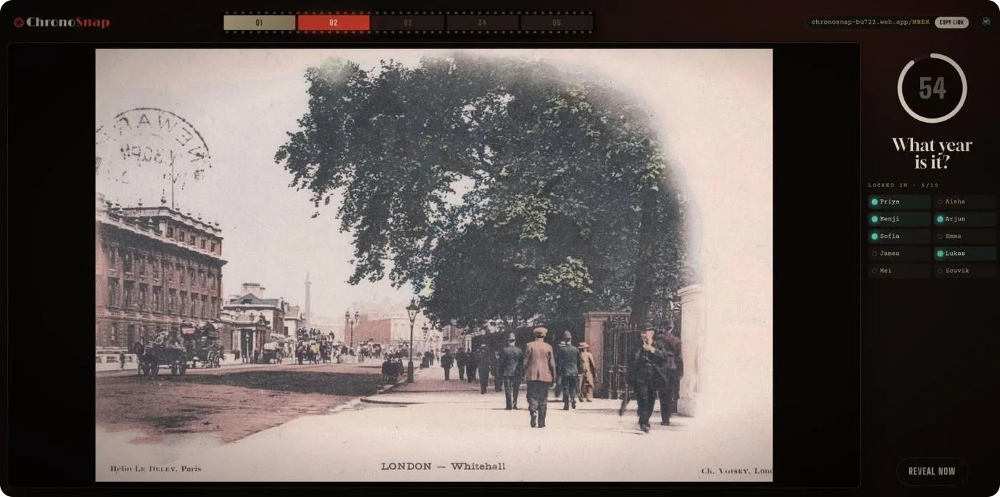
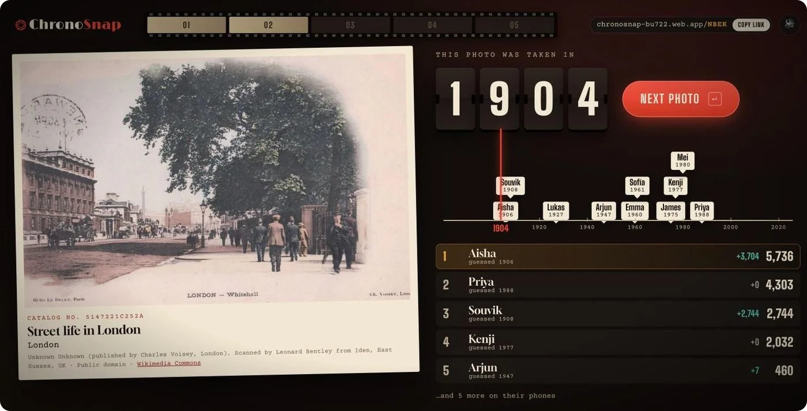
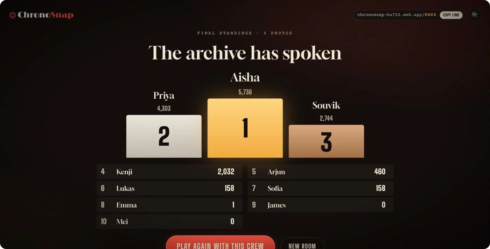
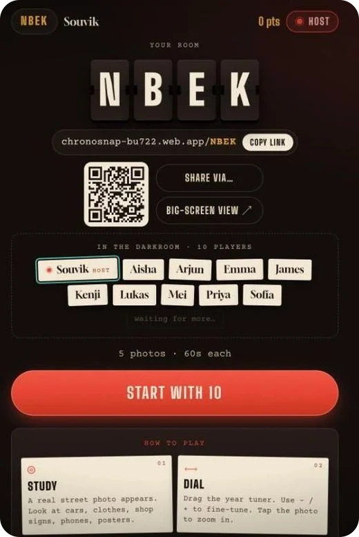
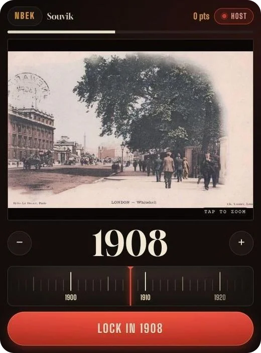
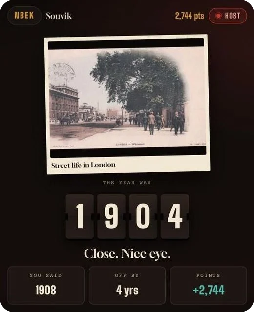

<p align="center">
  
</p>

<h1 align="center">ChronoSnap</h1>

<p align="center">
  <b>One photo. One year. How well do you know your decades?</b><br />
  A multiplayer time-travel photo guessing game for team meetings and icebreakers.
</p>

<p align="center">
  <a href="https://chronosnap-bu722.web.app"><b>▶ Play now</b></a> ·
  <a href="docs/ARCHITECTURE.md">Architecture</a> ·
  <a href="docs/PHOTO_PIPELINE.md">Photo pipeline</a> ·
  <a href="docs/DEVELOPMENT.md">Development</a>
</p>

---

Everyone sees the same archival street photo. Players study the cars, clothes, shop signs and street furniture, then dial in the year it was taken on their phone. The closer the guess, the more points. It works in a meeting room or over Meet, Zoom or Teams.

- **No downloads, no accounts.** Join from any phone or laptop with a 4-letter room code, a QR code, or a **one-click invite link** (`…/ABCD`). Paste it in chat and people land on a "You're invited" screen: type a name, tap Join.
- **The creator is the host, and plays too.** A **Host** panel on their phone lets them start, end a round early, skip ahead, remove players or end the game.
- **Hands-free rounds.** A server-side timer ends each round (or ends it early once everyone has locked in), and the next photo starts on its own after the reveal.
- **Optional big screen.** A spectator view to screen-share: split-flap year reveals, a timeline of everyone's guesses, a live leaderboard.
- **180 public-domain photos from around the world**: 30 each from South Asia, Europe, UK & Ireland, North America, East Asia and the rest of the world, spread evenly from the 1880s to 2025. Every game mixes decades and regions, and a room never repeats photos.
- **Built-in how-to-play guide** in the lobby while everyone waits, with rotating "spot the era" tips.
- **A darkroom aesthetic:** safelight red, silver-gelatin paper, photos that "develop" on screen, a radio-tuner year dial, and synthesized shutter and flap sounds.

## Screenshots

### Big screen (optional, for screen-sharing)

<table>
  <tr>
    <td width="50%" valign="top"><br /><sub><b>Lobby:</b> code, QR, one-click invite link, how-to-play, who's in</sub></td>
    <td width="50%" valign="top"><br /><sub><b>Guessing:</b> the photo, the countdown, who has locked in</sub></td>
  </tr>
  <tr>
    <td width="50%" valign="top"><br /><sub><b>Reveal:</b> split-flap year, guess timeline, leaderboard</sub></td>
    <td width="50%" valign="top"><br /><sub><b>Final:</b> podium and full ranking</sub></td>
  </tr>
</table>

### Phone controller (every player, including the host)

<table>
  <tr>
    <td width="33%" valign="top"><br /><sub><b>Lobby:</b> share link, who's in, Start (host)</sub></td>
    <td width="33%" valign="top"><br /><sub><b>Guess:</b> drag the tuner, lock in</sub></td>
    <td width="33%" valign="top"><br /><sub><b>Reveal:</b> your guess, how far off, points</sub></td>
  </tr>
</table>

## How a game works

| Step | Room creator (phone) | Other players (phone) | Big screen (optional) |
|---|---|---|---|
| **Lobby** | Sees code, QR and share link; taps **Start** | Joins with code or link and picks a name | Shows code, QR and a "contact sheet" of who's in |
| **Guess** (15–60s) | Studies the photo, drags the year dial, **Locks in** | Same | Shows the photo, countdown and who has locked in |
| **Reveal** | Sees the true year, their points and rank; can **Skip ahead** | Same, without Skip | Split-flap year, timeline of everyone's guesses, leaderboard |
| **Next** | Starts automatically after 5–15s (or manually) | — | — |
| **Final** | Podium, full ranking, **Play again** | Final rank and ranking | Podium and full ranking |

A round ends when the timer runs out **or** as soon as every player has locked in.

### Scoring

Points decay exponentially with the distance between the guess and the real year:

```
points = max(0, floor(5000 × e^(−0.15 × |actual − guess|)))
```

| Off by | 0 | 1 | 3 | 5 | 10 | 25 |
|---|---|---|---|---|---|---|
| Points | 5,000 | 4,303 | 3,188 | 2,361 | 1,115 | 117 |

---

## Tech stack

| Layer | Choice |
|---|---|
| Frontend | React 19 + TypeScript, Vite, React Router, hand-written CSS (no UI kit) |
| Realtime state | Cloud Firestore `onSnapshot` listeners (with long-polling fallback for strict corporate networks) |
| Game logic | Cloud Functions for Firebase (2nd gen, Node 22): callable functions, a Firestore trigger, Cloud Tasks queues and a scheduled job |
| Identity | Firebase Anonymous Auth, invisible to players |
| Hosting | Firebase Hosting (SPA plus WebP photo assets on the CDN) |
| Photo pipeline | Node scripts: Wikimedia Commons and Library of Congress APIs → filter → local curation UI → `sharp` WebP encoding |

Read more in the technical docs:

- [Architecture](docs/ARCHITECTURE.md): system design, data model, game state machine, security rules, timing.
- [Photo pipeline](docs/PHOTO_PIPELINE.md): sourcing, filtering, curating and building the photo set.
- [Development and deployment](docs/DEVELOPMENT.md): local emulators, testing tools, deploying, costs.

---

## Quick start (local)

Requirements: Node 20+ (24 tested) and Java 21+ for the Firebase emulators. `dev/emulators.sh` falls back to Android Studio's bundled JDK automatically.

```bash
npm install
npm --prefix functions install

# Terminal 1: Auth, Firestore, Functions and Cloud Tasks emulators
npm run emulators

# Terminal 2: the web app wired to the emulators
npm run dev:emu
```

Open <http://localhost:5173>, choose **Create a room**, then join from another tab or device with the code. In emulator mode each browser tab is its own anonymous player, so a few tabs make a whole team.

Want a crowd? `npm run bots -- ABCD 8` adds 8 simulated players to room `ABCD`.

## Deploy

```bash
cp .env.example .env.local      # fill in your Firebase web app config
firebase use --add              # pick your Firebase project (Blaze plan)
npm run deploy                  # builds web + functions and deploys everything
```

[DEVELOPMENT.md](docs/DEVELOPMENT.md#deploying-to-firebase) covers the one-time console setup (Anonymous Auth, Firestore, Blaze).

---

## Project layout

```
chrono_snap/
├── src/                    React app
│   ├── pages/              Home (join/create), Play (phone controller), Host (big screen)
│   ├── components/         SplitFlap, TimeDial, Timeline, Leaderboard, Countdown, FilmStrip…
│   ├── firebase.ts         SDK init, emulator wiring, callable API, server-clock sync
│   ├── game.ts             join, start/advance, auto-advance fallback
│   ├── hooks.ts            Firestore subscriptions and countdown hooks
│   ├── sound.ts            WebAudio synthesized SFX (no audio files)
│   └── styles.css          the darkroom design system
├── functions/src/          Cloud Functions (authoritative game engine)
│   ├── index.ts            rooms, rounds, reveal/scoring, tasks, cleanup
│   ├── scoring.ts          exponential scoring curve (+ tests)
│   ├── photos.ts           dataset loader and decade-balanced photo picker
│   └── photos.json         answer key (server-only, generated)
├── pipeline/               offline ETL: fetch → curate → build
├── public/photos/          180 WebP photos (generated, ~46 MB)
├── docs/                   architecture, photo pipeline, development docs
│   └── images/             README cover + screenshots (built by dev/readme-images.mjs)
├── dev/                    emulator launcher, bot players, phone-frame + README previews
├── firestore.rules         client access rules
├── firebase.json           Hosting, Firestore, Functions and emulator config
└── LICENSE                 MIT
```

## License

The code is released under the [MIT License](LICENSE). © 2026 Souvik Biswas.

The photos are **not** covered by the MIT License. Each keeps its original licence: public domain, CC0, CC BY or CC BY-SA, mostly via Wikimedia Commons. Every reveal shows the photographer, the licence and a link to the source page, and the full credit list lives in `functions/src/photos.json`.
