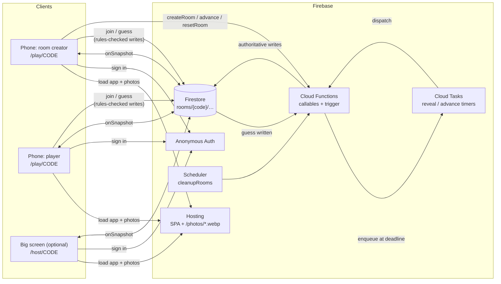
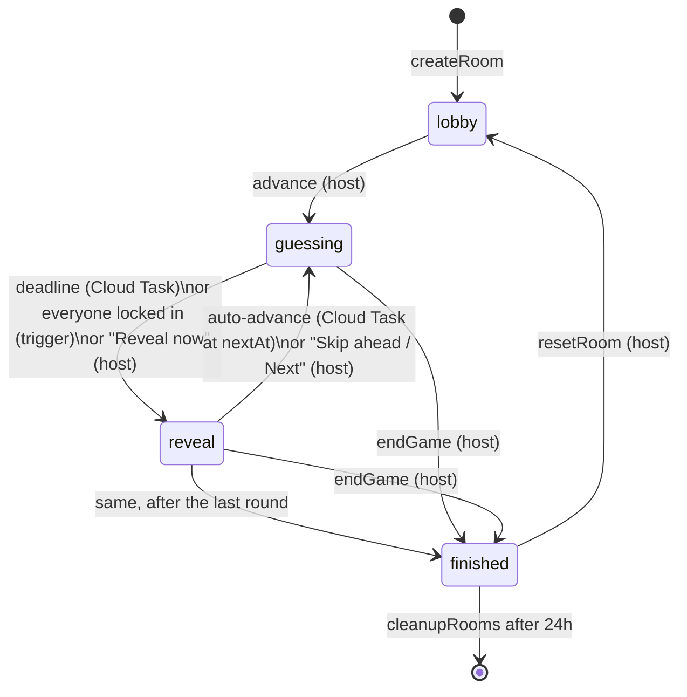
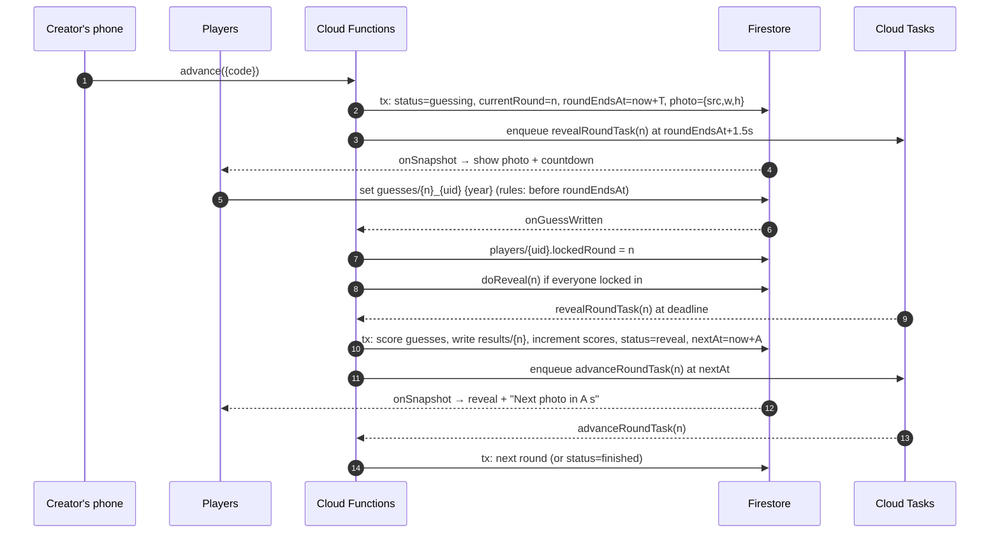

# Architecture

ChronoSnap is a static single-page app backed entirely by Firebase managed services. There is no long-running server: **Firestore is the shared game state**, and **Cloud Functions are the only writers of anything that matters** (rounds, deadlines, scores, answers).



## Design principles

1. **The server owns time and truth.** Deadlines are server timestamps. Reveals and scoring run in Firestore transactions inside Cloud Functions. Clients only *display* countdowns.
2. **Answers never reach the client early.** The answer key (`functions/src/photos.json`: year, title, location, clues) ships only with the functions bundle. During a round, clients get just an opaque photo id and image URL. The reveal payload is written to `results/{round}` only after the round closes.
3. **Every timer has a backup.** Each server timer (a Cloud Tasks job) is backed by an idempotent client "nudge". If a task is lost, the next client to notice nudges the server, which re-checks and either acts or does nothing.
4. **Idempotent transitions.** Every state change is conditioned on the current `(status, currentRound)` inside a transaction, so duplicate or late triggers are harmless.
5. **Zero-friction identity.** Anonymous Auth gives every device a stable uid without a sign-up. The room creator's uid is stored as `hostUid` and unlocks host controls.

---

## Game state machine



### Round lifecycle (sequence)



---

## Data model (Firestore)

```
rooms/{code}                         code = 4 letters, no I/O (e.g. "BJCQ")
  code            string
  hostUid         string             creator's anonymous uid
  status          "lobby" | "guessing" | "reveal" | "finished"
  createdAt       timestamp
  settings        { totalRounds: 1–15, roundSeconds: 10–120, autoAdvanceSeconds: 0–60 }
  photoIds        string[]           opaque ids chosen at game start
  currentRound    number             -1 in lobby, 0-based afterwards
  roundEndsAt     timestamp | null   guessing deadline (server time)
  nextAt          timestamp | null   when auto-advance fires during reveal
  photo           { src, w, h } | null   current image only, no answer data
  playedIds       string[]           every photo this room has used (no repeats on Play again)

rooms/{code}/players/{uid}
  name            string (1–20)
  score           number             written by functions only (after creation)
  lockedRound     number             last round this player guessed in (set by trigger)
  joinedAt        timestamp

rooms/{code}/guesses/{round}_{uid}
  uid, round, year (1880–2100), at (server timestamp)

rooms/{code}/results/{round}         written once per round, at reveal
  round
  photo           { src, year, title, location, source, credit, license, sourceUrl, clues[] }
  players         { [uid]: { name, year | null, points, total } }
  revealedAt
```

### Why this shape

- **Per-room subcollections** keep every query scoped to one room and let `recursiveDelete` clean up a room in one call.
- **Guess ids encode `{round}_{uid}`**, so a player has exactly one guess per round (re-locking overwrites it), and the rules can tie the id to the caller.
- **`lockedRound` lives on the player doc** so the big screen can show who has locked in without being able to read anyone's guess.
- **`results/{round}` is a snapshot.** Reveal screens render from one document, including names at that moment, so late renames or kicks don't rewrite history.

---

## Cloud Functions

All functions run in `us-central1` (2nd gen, `maxInstances: 20`).

| Function | Type | Who can trigger | What it does |
|---|---|---|---|
| `createRoom` | callable | any signed-in user | Validates settings, allocates a unique code in a transaction (up to 8 attempts), creates the room with `hostUid = caller`. |
| `advance` | callable | host; or anyone with `{auto: true, round}` | Host path: lobby → round 0, reveal → next round, last reveal → finished. Auto path: only acts if the room is still revealing `round` and `nextAt` has passed (the client fallback for the advance timer). Picks photos at game start, balanced across decades and avoiding the host's recent photos. |
| `advanceRoundTask` | Cloud Tasks queue | scheduled by `doReveal` | Same as the auto path of `advance`. |
| `revealRound` | callable | host (`force`); anyone (nudge) | `force: true` = host's "Reveal now". Without force, anyone can call it, but it reveals only once the deadline has passed (the client fallback for the reveal timer). |
| `revealRoundTask` | Cloud Tasks queue | scheduled by `advance` | Calls `doReveal(round)` 1.5s after the deadline. |
| `onGuessWritten` | Firestore trigger | any guess write | Sets `lockedRound`, then tries `doReveal`, which succeeds only once everyone has guessed (early end). |
| `resetRoom` | callable | host | Resets scores and status to lobby, clears `guesses` and `results`. |
| `kickPlayer` | callable | host | Deletes a player doc (not the host's own). |
| `endGame` | callable | host | Ends the game now, straight to `finished`. A round that hasn't been revealed is not scored. |
| `cleanupRooms` | scheduled (every 6h) | Cloud Scheduler | Recursively deletes rooms older than 24h. |
| `serverTime` | callable | anyone | Returns `Date.now()` for client clock-offset estimation. |

### `doReveal` (the scoring transaction)

Inside one transaction:

1. Abort unless `status == "guessing"` and `currentRound == round`.
2. Read all players and this round's guesses.
3. Proceed only if `force`, the deadline has passed, or every player has a guess.
4. For each player, `points = scoreGuess(actualYear, guess)`, then `FieldValue.increment(points)`.
5. Write `results/{round}` with the full answer payload and per-player breakdown.
6. Set `status = "reveal"` and `nextAt = now + autoAdvanceSeconds` (or `null` for manual).

After commit, enqueue `advanceRoundTask` for `nextAt`.

### Photo selection

`pickPhotos(pool, count, recentIds)` Fisher–Yates shuffles the pool and picks greedily in passes: a new decade **and** a new world region, then a new decade, then anything. Unplayed photos are exhausted before any played photo is reused. The final order is shuffled again, so games never run oldest to newest. A 5-round game therefore spans five decades and, usually, five regions. `scoring.test.ts` checks this statistically over 3,000 simulated games.

Repeats are avoided at two levels:

- The room stores `playedIds` (every photo it has used), so **Play again** never repeats until the pool runs low.
- Each device keeps its last 120 photo ids in `localStorage` and sends them as `recentIds`, which covers new rooms from the same creator.

---

## Security rules (summary)

The Admin SDK in Functions bypasses rules. For clients, `firestore.rules` allows:

| Path | Read | Write |
|---|---|---|
| `rooms/{code}` | `get` if signed in (no `list`, so codes can't be enumerated) | never |
| `players/{uid}` | signed in | **create** own doc only: name 1–20 chars, `score == 0`, `lockedRound == -1`, `joinedAt == request.time`, room not finished. **update** own `name` only. |
| `guesses/{round}_{uid}` | `get` own guess only | create/update own guess only if: the id matches `{round}_{auth.uid}`, year is an int in 1880–2100, `at == request.time`, the player exists, the room is `guessing` on that round, and **`request.time < roundEndsAt`**. |
| `results/{round}` | signed in | never |
| everything else | never | never |

The guessing deadline is therefore enforced by Firestore itself, regardless of client clocks.

### Anti-cheat posture

ChronoSnap is a social game, so the goal is "no trivial cheating", not adversarial security:

- The answer year never reaches clients before the reveal. The client bundle contains no dataset (verified in the build).
- Photo ids and file names are salted SHA-256 hashes of the source id, so they can't be reversed to a Wikimedia page that states the year.
- Image edges are cropped by 4% during the build, removing most handwritten dates and catalog stamps (see [PHOTO_PIPELINE.md](PHOTO_PIPELINE.md)).
- Other players' guesses are unreadable until `results/{round}` is written.
- Scores are written only by functions.

Known, accepted gaps: a determined player could reverse-image-search a photo, and an anonymous user can rejoin after being kicked.

---

## Timing and clocks

| Concern | Mechanism |
|---|---|
| Deadline source of truth | `roundEndsAt` server timestamp, enforced by rules (`request.time < roundEndsAt`) |
| Ending a round on time | `revealRoundTask` at deadline + 1.5s grace (for in-flight writes); fallback: every client nudges `revealRound` 3–4.5s after the deadline (jittered; the server re-checks) |
| Ending a round early | `onGuessWritten`, then `doReveal` succeeds once everyone has locked in |
| Moving past a reveal | `advanceRoundTask` at `nextAt`; fallback: every client nudges `advance({auto:true})` 2.5–4s after `nextAt` (jittered; the server de-duplicates) |
| Early task delivery | Task handlers use `runWhenDue`: if a task arrives before its moment (e.g. the local Cloud Tasks emulator ignores `scheduleTime`), it waits in-process (≤130s, under the 180s task timeout) and tries once more. In production the wait is normally zero. Measured locally: exactly one task execution per transition. |
| Client countdowns | `serverNow() = Date.now() + offset`. The offset comes from 4 `serverTime` calls, keeping the sample with the lowest round trip (rejected if RTT > 2s), and re-syncs when the tab becomes visible. |
| Skewed phone clocks | Cosmetic only: the lock button stays enabled while the room is `guessing`, and the server decides. A late write shows "Too late — the shutter closed." |

## Frontend

| Route | Component | Purpose |
|---|---|---|
| `/` | `Home` | Join with a code, or create a room. Creating also joins you as a player. |
| `/:code` | `Home` (invite mode) | The **invite link**. A focused "You're invited to room ABCD" screen with just a name field (remembered from earlier games) and a Join button. If this device is already in the room, it goes straight to `/play/ABCD`. A missing or finished room gets a clear message. |
| `/play/:code` | `Play` | The phone controller for everyone. The creator also gets a **◉ HOST** button opening the host panel (`HostPanel`): start, end round now, next photo, end game early (with confirmation), remove players, play again, open the big screen. |
| `/host/:code` | `Host` | Big-screen spectator view for screen-sharing. Anyone can open it; controls appear only for the creator. |

State comes from four subscriptions (`useRoom`, `usePlayers`, `useResult`, own player/guess doc). There is no client-side game store; the UI is a pure function of Firestore state, so a refresh at any point resumes exactly where the game is.

Notable components:

- **`TimeDial`**: a radio-tuner year picker (pointer drag with momentum, snaps to years, haptic tick and click at each decade, keyboard accessible as an ARIA slider).
- **`SplitFlap`**: departure-board tiles that clatter to the target value.
- **`Timeline`**: an 1880–now axis with stacked guess pins and the true year struck in red.
- **`Leaderboard`**: FLIP-animated reordering when scores change.
- **`DevelopingPhoto`**: images "develop" from an over-exposed sepia blur to a sharp print.
- **`sound.ts`**: shutter, ticks, flap clatter and fanfare, all synthesized with WebAudio.

The design tokens (colors, fonts, easing) are CSS custom properties at the top of `src/styles.css`. Fonts: Limelight (logo), Gloock (serif display), Big Shoulders Display (boards and buttons), Courier Prime (labels). `prefers-reduced-motion` disables grain and animations.

## Caching & cache busting

A long-lived game tab must never run a stale build, and returning players must get the latest app.

| Layer | Strategy |
|---|---|
| `index.html`, SPA routes, `version.json` | `Cache-Control: no-cache`. Every load revalidates with Hosting (`firebase.json`, header rule `!/@(assets|photos)/**`). |
| `/assets/*.js`, `*.css` | Vite content-hashed filenames, `max-age=31536000, immutable` |
| `/photos/*.webp` | Content-hashed filenames (`{id}.{sha256(bytes)[0:8]}.webp`, set by the pipeline build), `immutable`. A re-cropped photo gets a new URL. |
| Open tabs | Each build gets a unique `__APP_VERSION__` baked into the bundle and written to `/version.json`. `useNewVersionAvailable` polls it every 60s and when the tab becomes visible. `UpdateBanner` then **reloads automatically when no round is in progress** (lobby, reveal, finished, home), or shows "New version available · tap to reload" mid-round. Game state lives in Firestore, so a reload resumes exactly where the player was. Verified on production: an open tab reloaded itself about 2 minutes after a deploy. |

## Scale and limits

- **Players per room:** tested with 10 (8 bots + 2 humans). The big screen switches to a two-column locked-in grid above 6 players and shows the top 5 at reveal; everyone sees their own rank on their phone. Firestore and Functions comfortably handle 50+ players per room. The practical limit is screen real estate.
- **Concurrent rooms:** unlimited by design; each room is an isolated document tree.
- **Per-game cost:** about 25 function invocations and a few hundred Firestore reads/writes for a 10-player, 5-round game. See [DEVELOPMENT.md](DEVELOPMENT.md#costs).
