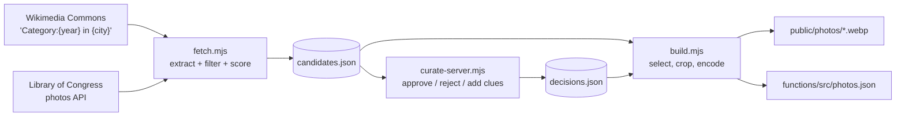

# Photo pipeline

ChronoSnap's photos come from an **offline batch pipeline**, so live games never depend on third-party APIs, rate limits or link rot. The output is two artifacts:

- `public/photos/*.webp`: images served by Firebase Hosting (1600px max, ~250 KB each)
- `functions/src/photos.json`: the answer key, bundled **only** with Cloud Functions



## 1. Fetch: `npm run pipeline:fetch`

```bash
node pipeline/fetch.mjs [--from 1880] [--to 2023] [--sources wikimedia,loc]
```

### Sources

| Source | Query strategy | Notes |
|---|---|---|
| **Wikimedia Commons** | Three category patterns (see `pipeline/regions.mjs` for the place lists): **`{year} in {city}`** for 22 core cities; **`{decade}s in {city}`** for 69 cities worldwide (including the historic names Bombay, Calcutta and Madras); and **`{year} in {country}`** plus **`{decade}s photographs of {country}`** for 16 under-represented countries (India, Pakistan, Bangladesh, Sri Lanka, Japan, China, Ireland, Scotland, Mexico, Brazil, Egypt, Turkey, South Africa, Australia, Nigeria, Kenya). Files only, with `imageinfo` + `extmetadata` and a 1600px thumbnail URL. | The main source. Every photo's exact year is still verified from its own date metadata. |
| **Library of Congress** | `loc.gov/photos` JSON API per decade × keywords (street scene, traffic, downtown, parade, storefront, main street) | Behind Cloudflare bot protection from some networks. The connector detects the challenge page and skips itself. |

Responses are cached in `pipeline/out/cache/` (sha1 of the URL), so reruns are instant and kind to the APIs. Requests send a descriptive `User-Agent` with a contact address, as Wikimedia's API etiquette requires.

### Quality filter

A candidate must pass **all** of these:

| Check | Rule |
|---|---|
| Format | JPEG or TIFF only (PNGs are usually graphics) |
| Resolution | width ≥ 1200px |
| Orientation | landscape, aspect ≥ 1.15 (it's shown on a 16:9 screen) |
| Licence | Public domain, CC0, "No restrictions", CC BY, CC BY-SA |
| **Verified single year** | `DateTimeOriginal` contains exactly one distinct 4-digit year, equal to the category year, with no fuzzy qualifiers (`circa`, `ca.`, `before`, `after`, `between`, `or`, `?`, `1960s`…) |
| Content | No "bad words" in title/description: map, painting, drawing, engraving, lithograph, poster, postcard, portrait, document, newspaper, stereograph, lantern slide… |

### Relevance score

Each surviving candidate gets +1 for every street-life keyword in its title or description (street, avenue, traffic, tram, market, parade, storefront, crowd, bus, cinema, diner, festival, and local forms like *rue*, *straße*, *calle*, *gatan*), plus 1 if it's at least 2000px wide.

A full run (1880–2023) makes about 3,200 queries and yields **~23,000 candidates**. Wikimedia's year-tree categories are densest for the 2000s–2010s and sparsest for the 1880s (~440).

## 2. Curate: `npm run pipeline:curate`

Opens a local review UI at <http://localhost:5199>:

- Grid of candidates with year, score and resolution; filter by decade or by decision.
- **A** approve, **R** reject, **J/K** move focus, click a photo to see it full size.
- Edit **title**, **location** and **visual clues** (one per line; shown as chips at reveal, e.g. "1968 Ford Mustang in foreground").
- Decisions save immediately to `pipeline/out/decisions.json`. Commit this file, since it's the editorial record.

Curation is what turns "plausible" into "great". Things to reject:

- Handwritten or printed dates in the image, including book captions ("Figure 17 — … 1955").
- Aerial or engineering-documentation shots with no human-scale clues.
- Near-duplicates of the same event.
- Photos where the year is trivially readable (a dated banner, a newspaper headline).

## 3. Build: `npm run pipeline:build`

```bash
node pipeline/build.mjs [--target 150] [--approved-only]
```

1. **Selection, balanced by decade and region.** Every approved photo goes in first. Unless `--approved-only` is set, the rest is filled round-robin across decades (`ceil(target / 15)` each), and within each decade picks rotate through the six regions: South Asia, Europe, UK & Ireland, North America, East Asia, rest of world. Each region competes only against itself. The English-keyword score favours wordy US captions, so outside North America a score of 0 is acceptable. There's also a cap of 2 per city per decade.
2. **De-duplication.** One auto-picked photo per normalized title and one per *(city, year)*, which removes series shots of the same scene. Extra exclusions are applied here too, so old candidate files benefit: HAER/HABS engineering records, "elevation", "plaque", "close-up", "aerial view", "interior", "negative", "Figure N" captions, food photos.
3. **Image processing (`sharp`).** EXIF-rotate, **crop a 4% border on every side** (removes most margin annotations, catalog numbers and black film edges), resize to fit 1600×1200, encode WebP at quality 76.
4. **Opaque ids.** `id = sha256("chronosnap-v1" + sourceId)[0:12]`. This is the file name and the id stored in room docs, so it can't be traced back to the source page.
5. **Title cleanup.** Strips accession numbers like `(CHS-6358)`, `(23399378513)`, `(NYPL …)`. Titles that are just catalog codes become "Street life in {city}".
6. **Output.** `functions/src/photos.json` (sorted by year) and `public/photos/`. Stale images that aren't in the dataset any more are deleted.

### Dataset record

```json
{
  "id": "e102a7972f3c",
  "src": "/photos/e102a7972f3c.webp",
  "w": 1600, "h": 1064,
  "year": 1971,
  "title": "Neon sign, tram",
  "location": "Vienna",
  "source": "Wikimedia Commons",
  "credit": "FOTO:Fortepan — ID 87530",
  "license": "CC BY-SA 3.0",
  "sourceUrl": "https://commons.wikimedia.org/wiki/File:…",
  "clues": [],
  "sourceId": "wm_12345678",
  "verified": false
}
```

`verified: true` marks photos approved by a human in the curation UI.

## Current dataset

- 180 photos: **12 per decade** from the 1880s to the 2020s, and **30 per region** (South Asia, Europe, UK & Ireland, North America, East Asia, rest of world)
- ~46 MB of WebP in total, from a pool of ~29,000 candidates
- Auto-selected by the pipeline, with 27 photos rejected after visual review of contact sheets (paintings, colour-checker scans, film-strip negatives, landscapes with no era clues).

The first 150-photo build was 70% US because of the English-keyword scoring. Region balancing fixed that. A human curation pass (adding clues and rejecting weak shots) is the recommended next step before a big event.

## Re-running after changes

```bash
npm run pipeline:fetch           # only if sources or filters changed (cached)
npm run pipeline:curate          # review; Ctrl+C when done
npm run pipeline:build           # regenerate photos + answer key
npm --prefix functions run build # emulator hot-reloads; or redeploy functions + hosting
```

Changing the 4% crop or the encoding only affects newly downloaded images. Delete `public/photos/*.webp` first to re-process all of them.
